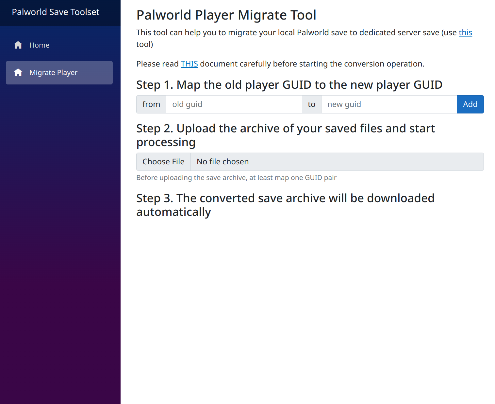

Palworld toolset
----
A toolset includes many open-source tools for the game Palworld.



Now these tools was integrated to this toolset:
- Player data migrate tool (Author: xNul , [repo](https://github.com/xNul/palworld-host-save-fix))

## Usage
```shell
docker run --name=pal-toolset -d -p 8080:8080 --pull zeroash/palworld-toolset
xdg-open http://localhost:8080 
```